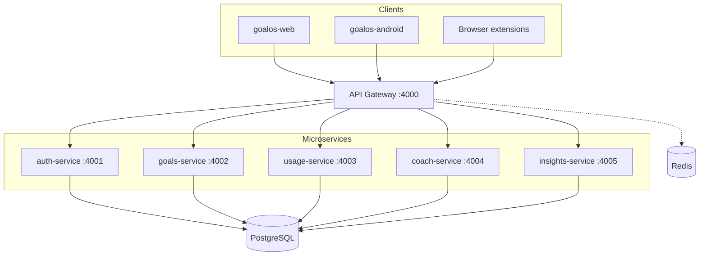

# GoalOS SaaS — Enterprise Microservices Architecture

GoalOS evolves from a **local-first OSS demo** into an **enterprise SaaS platform** with multi-tenant orgs, RBAC, centralized data, and independently deployable microservices.

## Architecture overview



## Bounded contexts

| Service | Owns | Port |
|---------|------|------|
| **api-gateway** | Routing, JWT validation, rate limits (future) | 4000 |
| **auth-service** | Users, orgs, memberships, RBAC, refresh tokens, audit | 4001 |
| **goals-service** | Goals, roadmaps, milestones | 4002 |
| **usage-service** | Usage events, tracked apps (ingestion from Android/web) | 4003 |
| **coach-service** | Coach chat, recommendations (rule-based MVP; LLM-ready) | 4004 |
| **insights-service** | Alignment score, snapshots, weekly reports, sprints, intent gates | 4005 |

## Multi-tenancy model

- **Row-level isolation** via `orgId` on every tenant table (MVP default).
- Each user belongs to one or more organizations via `OrganizationMember`.
- JWT carries `orgId` + `role` (`OWNER`, `ADMIN`, `MEMBER`, `VIEWER`).
- Enterprise upgrade path: schema-per-tenant or dedicated DB for large accounts.

## RBAC

| Role | Read product data | Write product data | Manage members |
|------|-------------------|--------------------|----------------|
| OWNER | ✓ | ✓ | ✓ |
| ADMIN | ✓ | ✓ | ✓ |
| MEMBER | ✓ | ✓ | ✗ |
| VIEWER | ✓ | ✗ | ✗ |

## API surface (gateway)

Base URL: `http://localhost:4000/v1`

### Public
- `POST /v1/auth/register` — create user + org
- `POST /v1/auth/login`
- `POST /v1/auth/refresh`

### Authenticated (`Authorization: Bearer <token>`)
- `GET /v1/orgs/me` — org + members + subscription
- `GET /v1/goals/active` · `POST /v1/goals`
- `POST /v1/usage/events` · `GET /v1/usage/apps/today`
- `GET /v1/coach/recommendation` · `POST /v1/coach/chat`
- `GET /v1/insights/score` · `GET /v1/insights/weekly`
- `POST /v1/insights/focus-sprints` · `POST /v1/insights/intent-checkins`

### Ops
- `GET /health` — gateway health
- `GET /v1/health/services` — all service health

## Shared packages

```
packages/
├── shared/     # JWT, scoring engine, Zod validation, server helpers
└── database/   # Prisma schema + client (PostgreSQL)
```

The **Goal Alignment Score v1** formula is centralized in `@goalos/shared` — same logic previously duplicated in web (`scoring.ts`) and Android (`ScoringEngine`).

## Enterprise roadmap

| Phase | Capability |
|-------|------------|
| **MVP (this scaffold)** | Auth, orgs, RBAC, Postgres, 5 services, gateway, Docker Compose |
| **Phase 2** | Stripe billing, seat limits, admin console |
| **Phase 3** | SSO (SAML/OIDC), SCIM provisioning |
| **Phase 4** | Server-side LLM coach, prompt versioning, cost controls |
| **Phase 5** | Event bus (Kafka/SQS), async insights, push notifications |
| **Phase 6** | SOC2 audit trail export, data residency, DSR APIs |

## Local development

### Prerequisites
- Node.js 20+
- Docker (for Postgres) or local Postgres

### Quick start

```bash
# 1. Copy env
cp .env.example .env

# 2. Start Postgres + Redis
docker compose up postgres redis -d

# 3. Install workspaces + generate Prisma client
npm install
npm run saas:build
npm run saas:db:push

# 4. Run all microservices
npm run saas:dev
```

Gateway: http://localhost:4000  
Web app (local-first mode): `npm run dev` in `goalos-web`

### Register a tenant

```bash
curl -X POST http://localhost:4000/v1/auth/register \
  -H "Content-Type: application/json" \
  -d '{"email":"founder@goalos.ai","password":"password123","orgName":"Acme Labs"}'
```

### Full stack with Docker

```bash
docker compose up --build
```

## Deployment (Render / production)

| Component | Render type |
|-----------|-------------|
| api-gateway | Web Service (`0.0.0.0:$PORT`) |
| Each microservice | Private Service (internal network) |
| PostgreSQL | Render Managed Postgres |
| Redis | Render Key Value |

Bind all HTTP services to `0.0.0.0:$PORT`. Use internal DNS for service-to-service calls from the gateway.

## Client integration

- **OSS mode:** `goalos-web` continues using `localStorage` (no backend required).
- **SaaS mode:** set `NEXT_PUBLIC_API_URL` and use `goalos-web/src/lib/api/goalos-api.ts` to sync state.

Android: point `UsageStatsCollector` batch uploads to `POST /v1/usage/events`.

## Data model

See `packages/database/prisma/schema.prisma` for the full schema including:
- `Organization`, `User`, `OrganizationMember`
- `Goal`, `RoadmapMilestone`
- `TrackedApp`, `UsageEvent`
- `FocusSprint`, `IntentCheckIn`
- `CoachMessage`, `ScoreSnapshot`
- `Subscription` (Stripe-ready)
- `AuditLog` (enterprise compliance)

## Security notes

- Change `JWT_SECRET` in production (32+ random bytes).
- Gateway validates JWT; services trust internal network in MVP — add mTLS or service mesh for production.
- Passwords hashed with scrypt + per-user salt.
- Refresh tokens stored as SHA-256 hashes.

## What stays local-first in OSS

The open-source GitHub Pages demo remains **fully offline** — no account required. The SaaS platform is an optional upgrade path for teams needing sync, admin, billing, and compliance.
